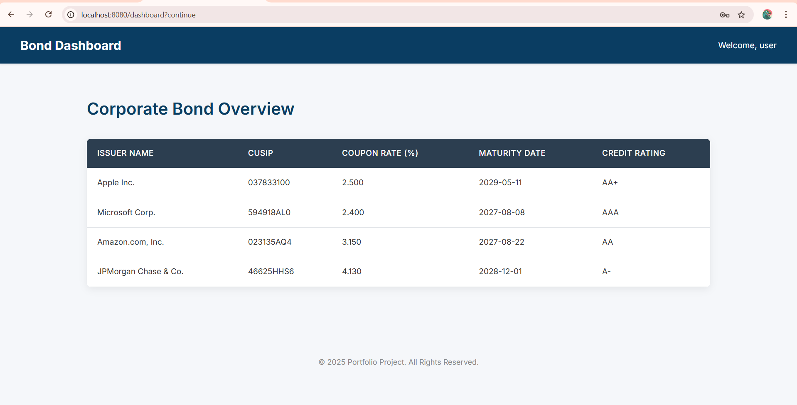

# Bond Analysis Dashboard

[](https://www.oracle.com/java/technologies/downloads/)
[](https://spring.io/projects/spring-boot)
[](https://www.postgresql.org/)
[](https://maven.apache.org/)

A full-stack, enterprise-style web application designed to demonstrate core Java, Spring Framework, and database skills. The Bond Analysis Dashboard provides a clean user interface to view and track key metrics for corporate bonds, simulating a tool that might be used by a financial analyst.

This project was built to mirror the technical requirements found in job descriptions for backend and full-stack developer roles within the financial services industry.

## Screenshot


*(Instructions: Take a screenshot of your running application at http://localhost:8080/dashboard and save it as `screenshot.png` in the root of your project directory.)*

## Features

- **Dynamic Data Display:** Fetches bond data from a backend database and dynamically renders it in a clean, professional-looking table.
- **N-Tier Architecture:** Built with a clear separation of concerns, following a professional Controller-Service-Repository pattern.
- **Data Persistence:** Uses Spring Data JPA and Hibernate to map Java objects to a PostgreSQL relational database, complete with automatic schema generation.
- **Secure by Default:** The application is secured using Spring Security, requiring user authentication to access endpoints.

## Tech Stack & Dependencies

- **Backend:**
  - Java 21
  - Spring Boot 3.x
  - Spring MVC
  - Spring Data JPA
  - Spring Security
  - Hibernate
- **Frontend:**
  - Thymeleaf (Server-Side Rendered Views)
  - HTML5 & CSS3
- **Database:**
  - PostgreSQL
- **Build & Tools:**
  - Apache Maven
  - Git & GitHub

## Getting Started

To get a local copy up and running, follow these simple steps.

### Prerequisites

Make sure you have the following software installed on your machine:
- JDK 21 or later
- Apache Maven
- PostgreSQL

### Installation & Setup

1.  **Clone the repository**
    ```sh
    git clone [https://github.com/your-username/bond-analyzer.git](https://github.com/your-username/bond-analyzer.git)
    cd bond-analyzer
    ```
    *(Remember to replace `your-username` with your actual GitHub username)*

2.  **Set up the PostgreSQL Database**

    Open a SQL tool (like `psql` or `pgAdmin`) and run the following commands:
    ```sql
    -- 1. Create the database
    CREATE DATABASE bond_analyzer_db;

    -- 2. Create a user and grant permissions
    CREATE USER bond_app_user WITH PASSWORD 'your_password';
    GRANT ALL ON DATABASE bond_analyzer_db TO bond_app_user;
    GRANT ALL ON SCHEMA public TO bond_app_user;
    ```

3.  **Configure the Application**

    Open the `src/main/resources/application.properties` file and update the datasource properties with the password you chose in the previous step.
    ```properties
    spring.datasource.url=jdbc:postgresql://localhost:5432/bond_analyzer_db
    spring.datasource.username=bond_app_user
    spring.datasource.password=your_password
    ```

4.  **Run the Application**

    Use Maven to run the application. The `CommandLineRunner` will automatically insert a sample bond into the database on the first run.
    ```sh
    mvn spring-boot:run
    ```

5.  **Access the Dashboard**

    - Open your web browser and navigate to `http://localhost:8080/dashboard`.
    - Log in using the username `user` and the generated password printed to your console log during startup.

## Project Architecture

This application follows a classic 3-tier architecture to ensure a clean separation of concerns:

-   **Controller Layer (`controller` package):** Handles incoming HTTP requests, validates input, and directs traffic. It is the entry point to the application from the web.
-   **Service Layer (`service` package):** Contains the core business logic. It acts as a mediator between the Controller and the Repository and is where complex operations and calculations are performed.
-   **Data Access Layer (`repository` & `domain` packages):** Responsible for all database interactions. The `domain` package holds the JPA Entities that model the database tables, and the `repository` package contains the Spring Data JPA interfaces that provide CRUD (Create, Read, Update, Delete) functionality.
